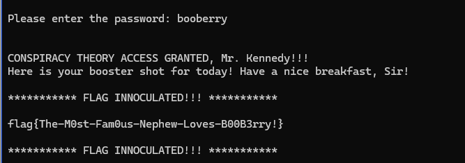

_______
К заданию приложен архив с бинарником и exe файлом следующего содержания:


________
Реверснув бинарник, находим место, где вводится пароль:


Нужно понять, что происходит со строкой до сравнения c obboreel.

``` 
void FUN_0001123d(char *param_1)

{
  int iVar1;
  char *local_14;
  size_t local_10;
  
  local_14 = param_1;
  local_10 = strlen(param_1);
  while (iVar1 = isspace((int)param_1[local_10 - 1]), iVar1 != 0) {
    local_10 = local_10 - 1;
    param_1[local_10] = '\0';
  }
  while ((*local_14 != '\0' && (iVar1 = isspace((int)*local_14), iVar1 != 0))) {
    local_14 = local_14 + 1;
    local_10 = local_10 - 1;
  }
  memmove(param_1,local_14,local_10 + 1);
  return;
}
```
```
void FUN_000113ec(char *param_1,char *param_2,int param_3)

{
  int iVar1;
  int local_10;
  
  for (local_10 = 0; (*param_1 != '\0' && (local_10 < 8)); local_10 = local_10 + 1) {
    iVar1 = islower((int)*param_1);
    if (iVar1 == 0) {
      *param_2 = *param_1;
    }
    else {
      iVar1 = *param_1 + -0x61 + param_3;
      *param_2 = (char)iVar1 + (char)(iVar1 / 0x1a) * -0x1a + 'a';
    }
    param_1 = param_1 + 1;
    param_2 = param_2 + 1;
  }
  *param_2 = '\0';
  return;
}
```

Похоже, что здесь происходят какие-то сдвиги. За неимением времени разбираться какие, пошла на dcode.fr 
для брутфорса потенциального шифра.

Сайт прдложил первым вариантом аффинный шифр, значит, будем брутфорсить его.

Из предложенных вариантов на название торговой марки (нормальное слово) booberry + вспоминаем, что в формулировке
задачи было словосочетание "spooky cereal", к чему нас отсылает "boo".


Попробуем этот пароль



