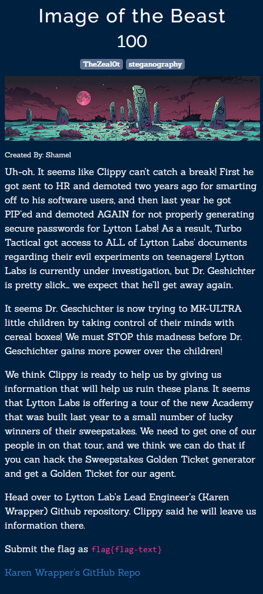
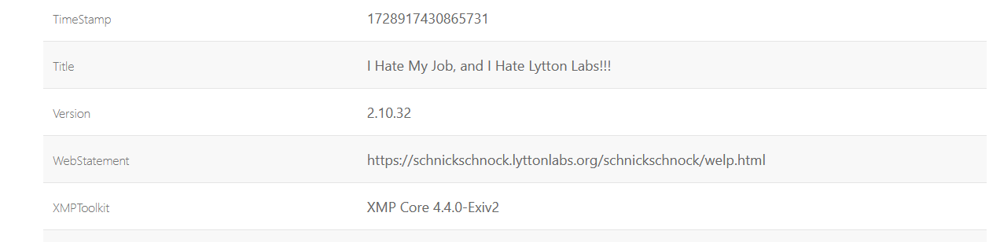

https://github.com/karenwrapper

В легенде написано про clippy. В репозитории есть файл, содержащий в названии это слово.

В EXIF'е этого файла находим ссылку на сайт. Там был флаг.

К сожадению, на момент написания врайтапа сайт уже отключили.