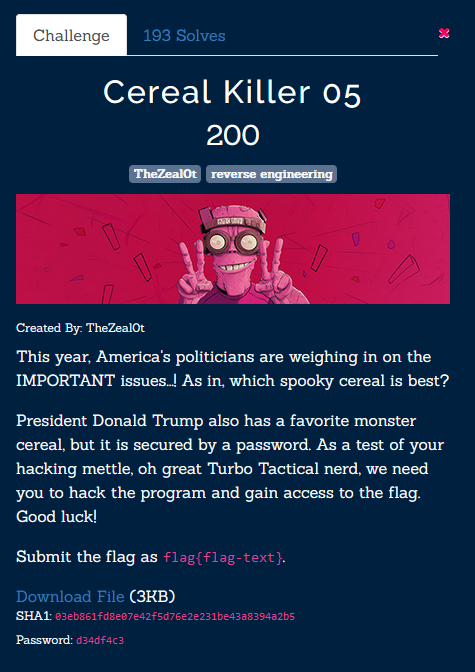
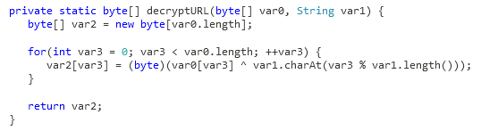
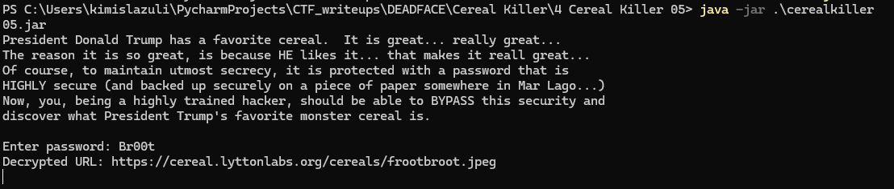
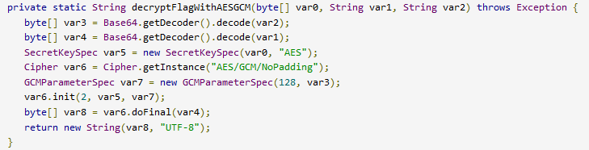
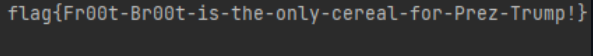

Декомпилируем джарник. Находим метод:

Чтобы имитировать работу, попробуем имитировать его работу для строки https.
В script.py получился Br00t.

Засунем чексумму этой картинки в метод:

И получим флаг.
