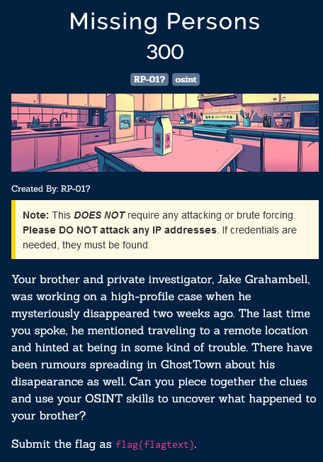

На лорном сайте в поиске пробиваем имя из задания.

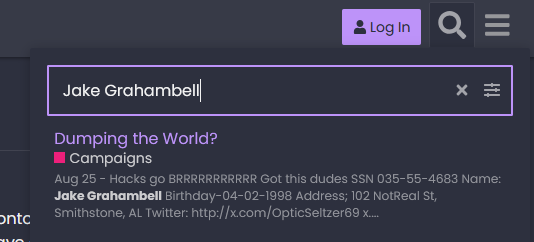

Находится ссылка на его [твиттер](https://x.com/OpticSeltzer69).

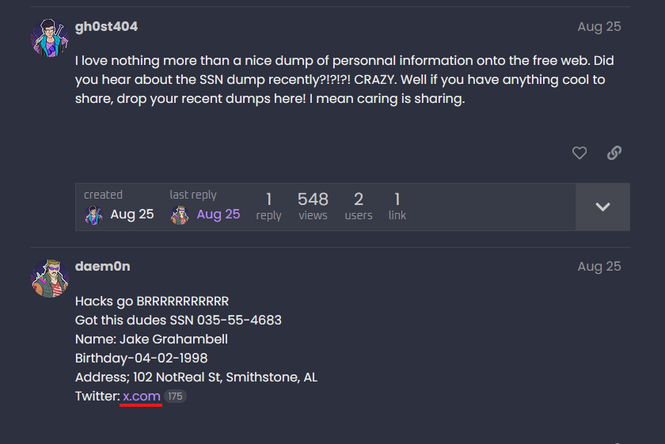

В твиттере есть две ссылки на гитхаб. Нужная нам https://github.com/Adorable-Welcome-268/

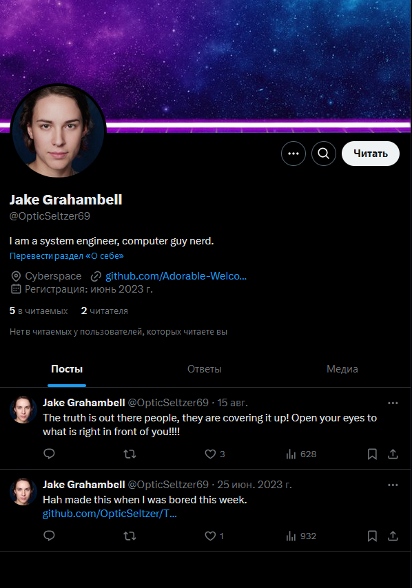

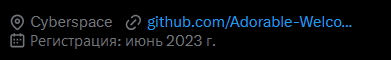

На гите видим 2 репозитория. Нам понадобится TRUTH.

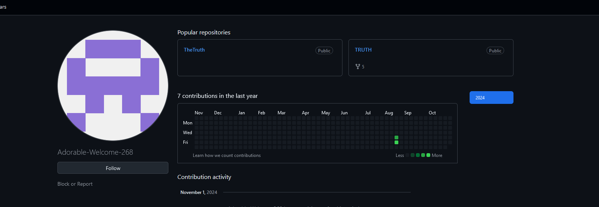
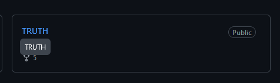

Кое-кто опубликовал информацию не для чужих глаз. Находим её по истории коммитов.

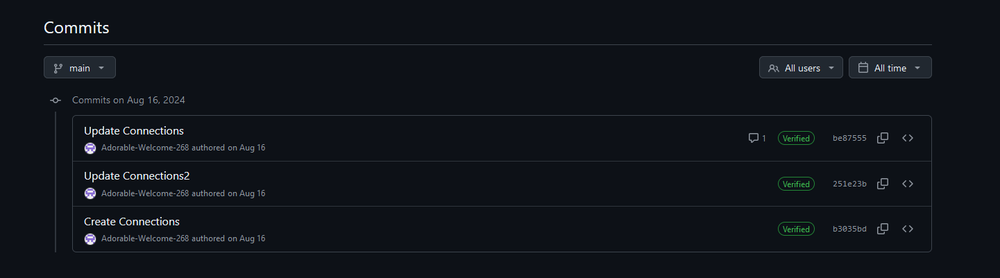
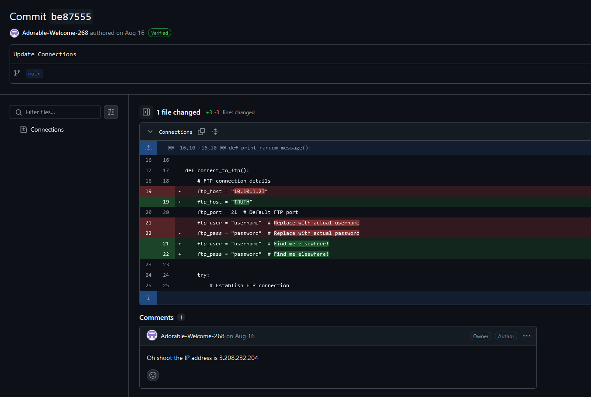

Ищем по гитхаб нику в надежде достать ещё информацию и находим реддит.

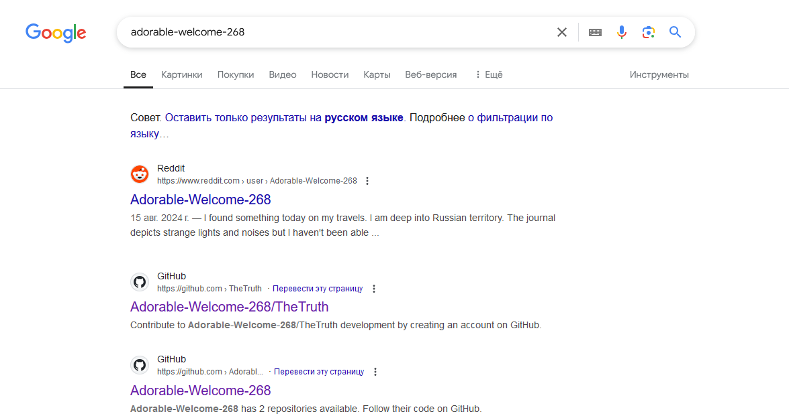

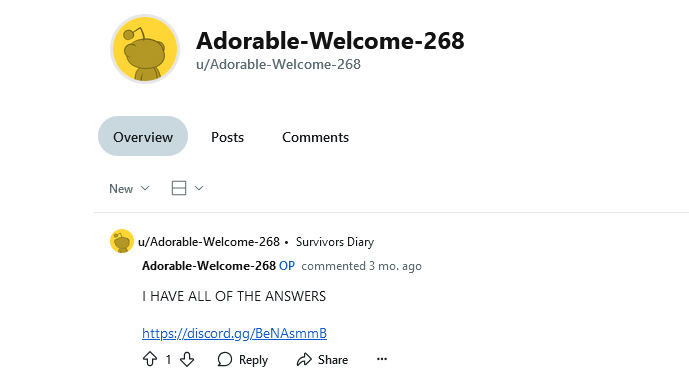

Тут есть ссылка на [дискорд](https://discord.gg/BeNAsmmB).

Бот запрашивает кодовое слово - то, на чём был помешан Джейк во время исследования. По реддиту и дискорду выясняем, что 
наш подопытный помешан на трагедии на перевале Дятлова. dyatlov - наш пароль к хинту.

**Получаем хинт:**

username:truthseeker

password: Truth!seeKer123

Подключаемся по FTP с этими кредами и забираем флаг.
____

flag{dyatlov-unlikelyplaceforaparty}

THEY HAVE ME IN A PRISON deep in the mountain, tell me family I love them. DAMN YOU DYATLOV PASS

