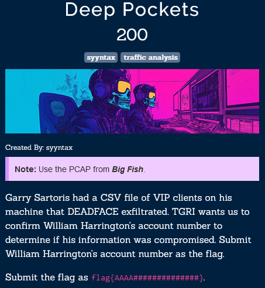
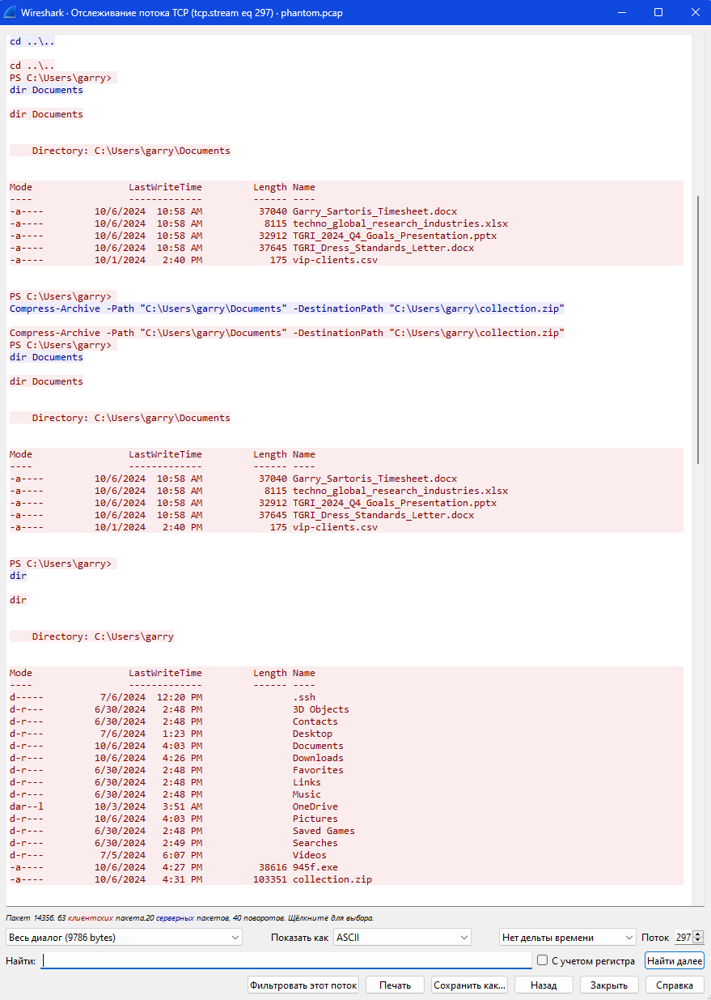
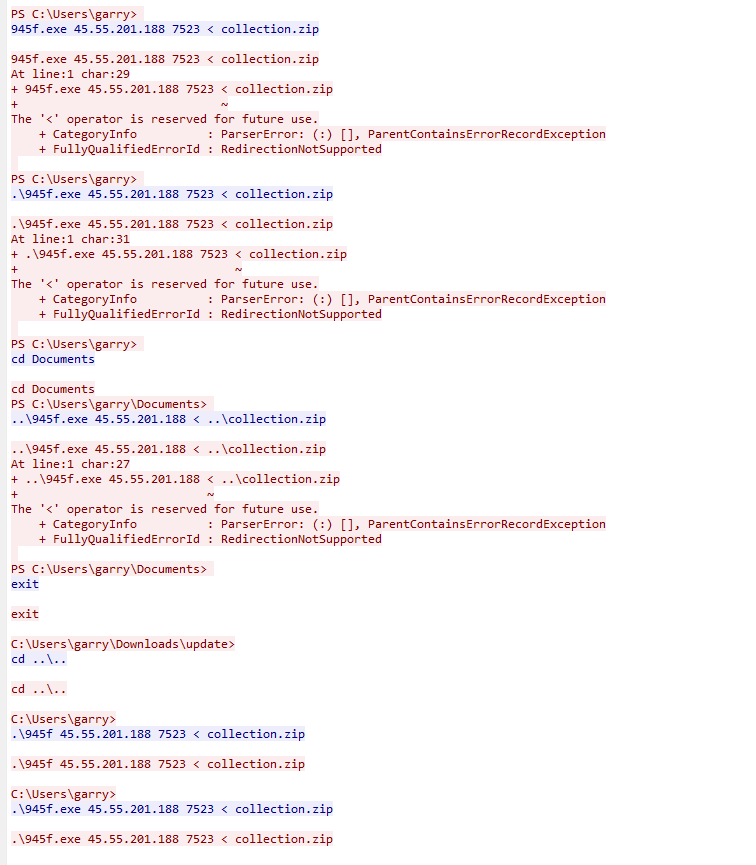
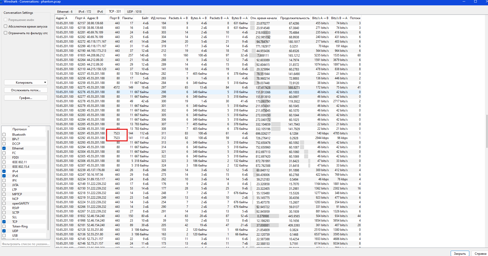
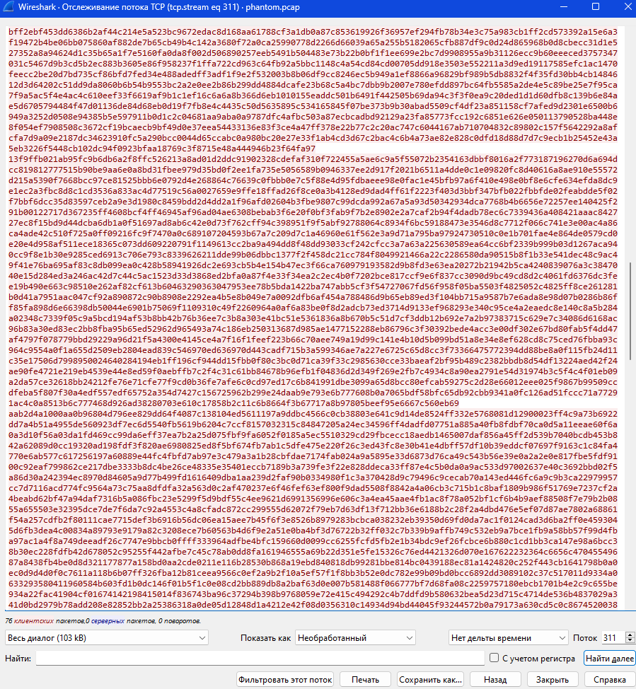
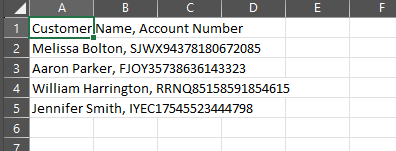

Листаем conversations, и обнаруживаем, что
кто-то упаковал и переслал папку, содержащую vip-clients.csv 
к себе на комп.

Находим диалог с соответствующим dst портом:

И сохраняем в сыром формате в формате .zip

В полученном архиве находим необходимый .csv файл.

