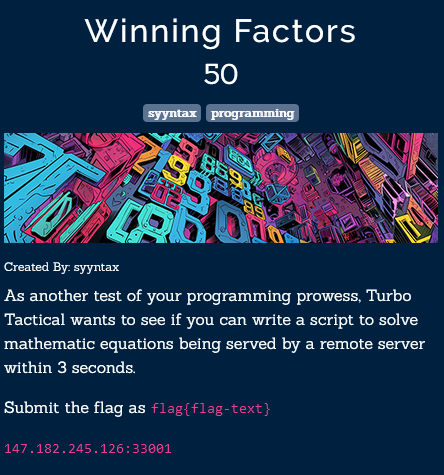
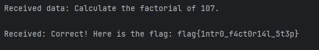

```python
import math
import socket

server_address = ('147.182.245.126', 33001)

with socket.socket(socket.AF_INET, socket.SOCK_STREAM) as sock:
    sock.connect(server_address)
    data = sock.recv(1024)
    print('Received data:', data.decode())
    number = int(data.decode().split(' ')[-1][:-2])
    calc = math.factorial(number)
    sock.send(str(calc).encode('utf8'))
    data = sock.recv(1024)
    print('Received data:', data.decode())
```

Нас просят посчитать факториал, считаем и получаем флаг.


