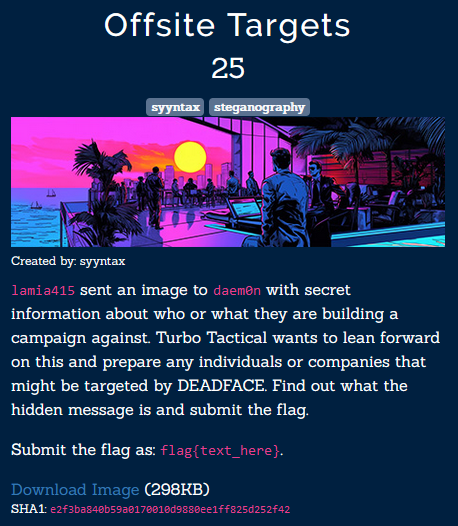
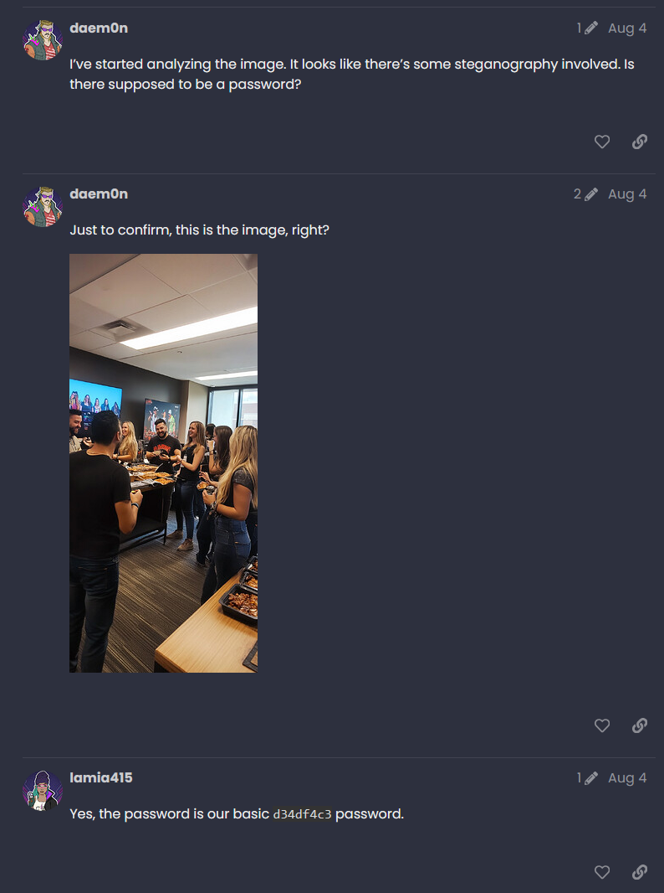
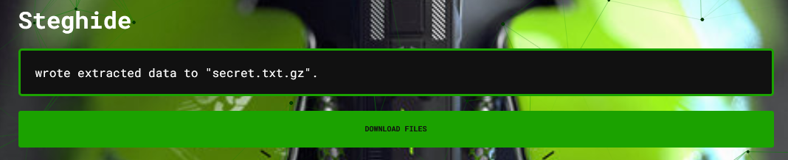

На лорном сайте турнира находим диалог:

Засовываем изображение в апери с указанным паролем.
В стегхайде видим это:

Распаковываем и получаем флаг:

Hope you're ready for some fun. I'm currently at the company off-site morale event, and it's the perfect opportunity to gather intel. I'll be sending you the details of some of my coworkers soon. With their info, you can craft some wicked social engineering campaigns. Get ready to make them dance to our tune.
flag{S0c14l_3ng1neer1ng_1nt3l_fr0m_0ff-s1t3}