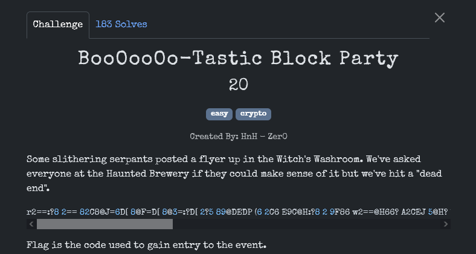
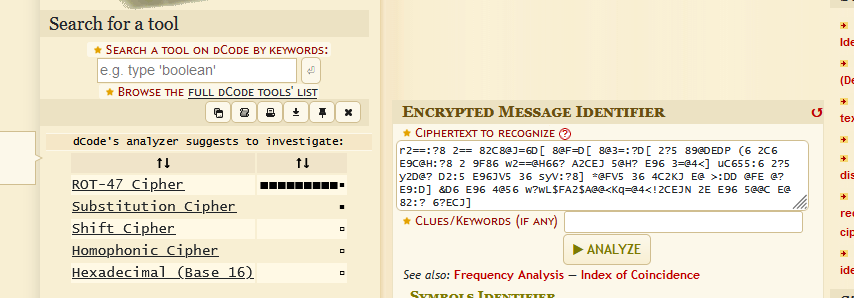
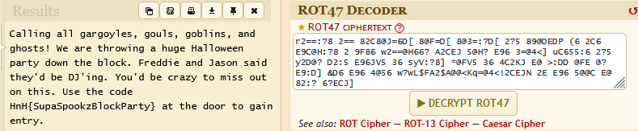

r2==:?8 2== 82C8@J=6D[ 8@F=D[ 8@3=:?D[ 2?5 89@DEDP (6 2C6 E9C@H:?8 2 9F86 w2==@H66? A2CEJ 5@H? E96 3=@4<] uC655:6 2?5 y2D@? D2:5 E96JV5 36 syV:?8] *@FV5 36 4C2KJ E@ >:DD @FE @? E9:D] &D6 E96 4@56 w?wL$FA2$A@@<Kq=@4<!2CEJN 2E E96 5@@C E@ 82:? 6?ECJ]

Не очень понятно, что за шифр, поэтому вставляем в определитель шифра.

Дешифруем и видим флаг.

