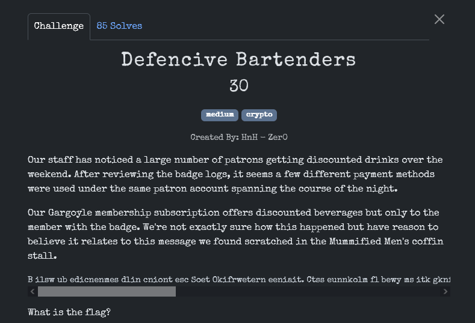
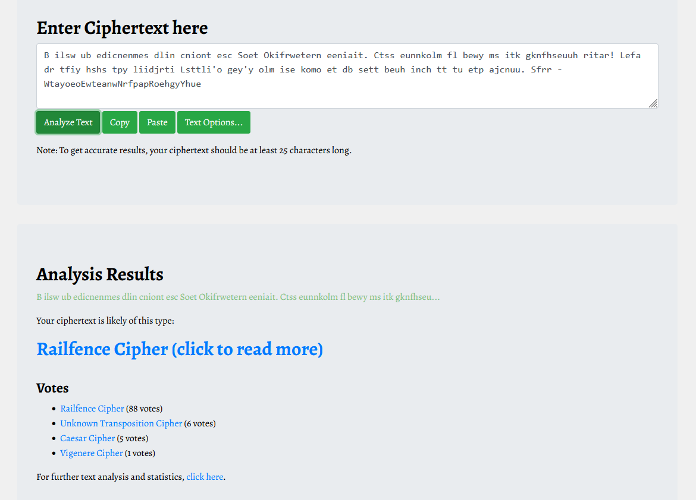
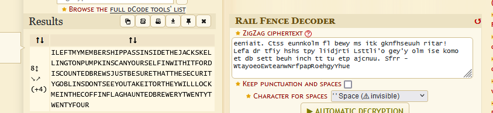

B ilsw ub edicnenmes dlin cniont esc Soet Okifrwetern eeniait. Ctss eunnkolm fl bewy ms itk gknfhseuuh ritar! Lefa dr tfiy hshs tpy liidjrti Lsttli'o gey'y olm ise komo et db sett beuh inch tt tu etp ajcnuu. Sfrr - WtayoeoEwteanwNrfpapRoehgyYhue

Проверим, что за шифр в определителе шифра.

https://www.boxentriq.com/code-breaking/cipher-identifier

И воспользуемся дешифратором.

 

В конце видим флаг.