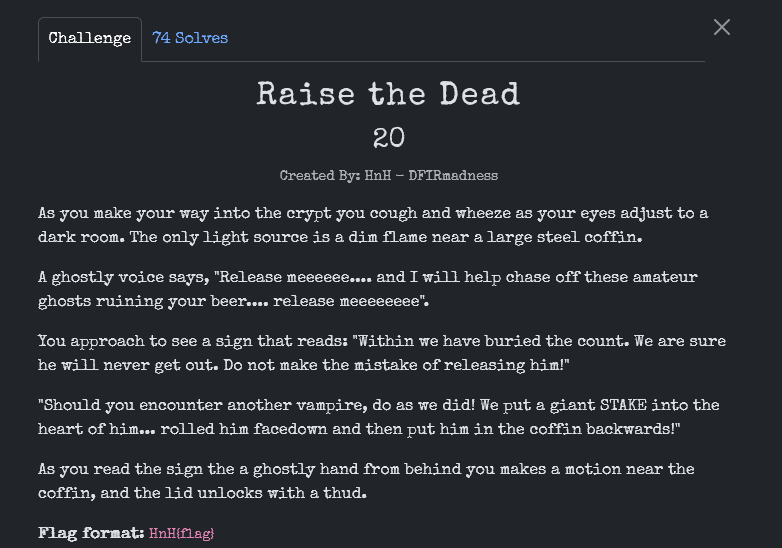
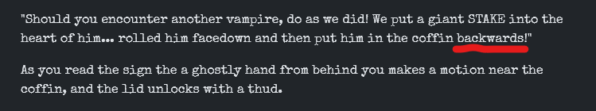
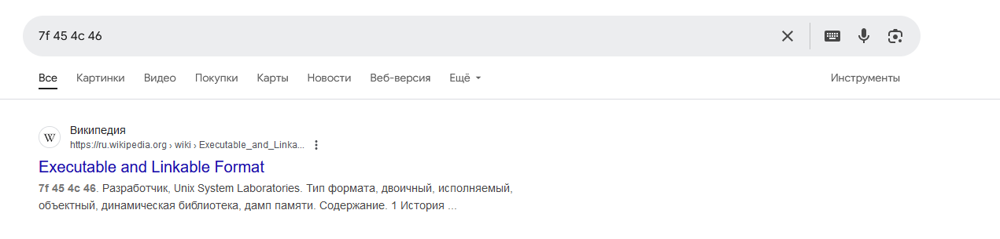
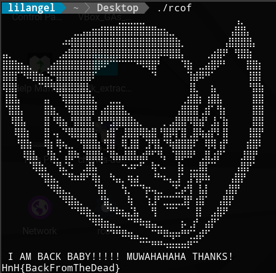

Внимательно читаем лор таски, и видим

Значит, начало в конце, смотрим на последние байты в поисках хедера `64c454f7`,
разворачиваем их `7f454c46`.

Находим, что это ELF.

Развернув файл, получим исходник, который можно собрать и запустить.

