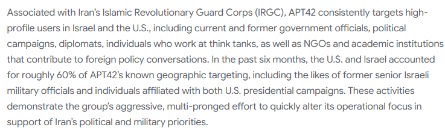

# UNC788 - Bigger Picture

\
Находим, что UNC788 так же известны как APT42, гуглим их и находим например https://blog.google/threat-analysis-group/iranian-backed-group-steps-up-phishing-campaigns-against-israel-us/ \
