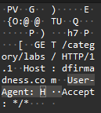

# Ghost on the Wire

\
В лоре таски подсказка в виде странного браузера который постоянно открывался и записки "do more labs"...\
В самом pcap'e ищем labs, находим некоторое количество HTTP пакетов\
\
Подсказка с браузером намекает на то, что смотреть надо в User-Agent заголовки этих запросов\
\
Видим, что в User-Agent побуквенно лежит флаг
