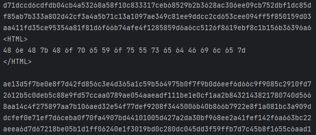

# Gremlins on the Wire 3

\
В вайршарке скачиваем архив который передавался по фтп\
\
Распаковываем архив, пишем небольшой скриптик для просмотра каждого файла\
```python
for i in range(1, 1001):
    with open(f"f/{i}") as file:
        print(file.read())
```
Просматриваем аутпут, замечаем как один файлик выбивается из общего потока \
\
Копируем байты, переводим из хекса в аски и получаем флаг\
