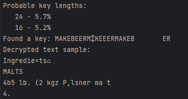
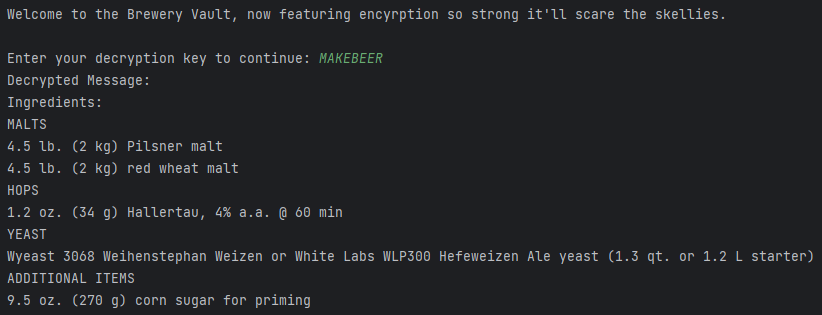

# Cauldron's Brew

\
Нам дается python скрипт
```python
secret_recipe = b'G\x08%"0 !;(/?6xO\x08\x13\x01\x15\x18Ovkpr!#eejwe9*hk\x15+)6<(3k(#)1Xyo~e.\'kresk.%le (%k2* $&m,*)6O\r\x1d\x1d\x12Atlwe=7okmqqe5da\x03$.)  9 >ibq`r,o*kb\x05ed}a&,,O\x1c\x17\x0c\x12\x1fO\x15< 3>5kvrs}r\x1a$"-\'+6&(1#$,e\x127$;.+b*7r\x1a)"1\'e\t3/2k\x12\x0e\x15vb}a\x03 $ 27$;.+b\x04)7m8.$11ez|oxe31kr"3ktlwe\x1em2?$01  dK\n\x01\x06\x0c\x11\x1b\x02\x0f\n\tb\x0c\x11\x17\x00\x12A|lpe=7okmprur*hk&-7+r>4,$0e#=?a;7+(,<*KA\x162 &;+(($6,*<>{A\x1c+ )6wa~e%$)>"/8ejt}|ta\x07lH\n7;*(%$.e\x02 ,7"1;\x7feccq\x7f}H\x03,<,-k\x020$3;98qeskucG\x00\t\x13xeq|tqnO\x0b\x07\x10hmpsO\x11\x17\x08hmrepHO\x01;?$(1+*+!wK\x06$) e+"49e; $!9a81#717?ay\xa7\xc2\xd6vr) 26b$-7,%k*$e1; $ee\n $&mrk"#))=#2kmste\x1eda$#b2$&(3k1-e1:(a;7-5  m2?7+. r9$&5\'7$&83.e6*e?,2#e++e39azq{\x87\xf5r\x0bacsw\x87\xf5r\x0ehee\x0b#e+"49e/$)&m %!b 4\'$1& ,1e;>a*1b7*= a? /5  ,5>7\'ie&%$k667,9(a<$6 7r9$&5\'7$&83.e1-*\'!%k\'\'e$ "4%!btsb\x8f\xf1k\x03bmrc\x8f\xf1k\x06kke\x1f,2#e#1ecyx\x89\xf5b\x03ez{t\x89\xf5b\x06lr+.9etu\xa7\xd2\xdev~e/,+\'9$8kb\x08$!%a$06e$&mp}}\x80\xf5e\x14mi|s\x80\xf5e\x11da*+&e77.(9&7)$&(ok\x06-))7.5kpl|e5,-\'*,6ez\x7fsk\tke*4m6$76ke\x0b"4\xa9\xc5\xdb))r#$.!b$\'=85kvlpe5,-\'*,6ez|rk\tke*4m2;$0" r: ? 0e#=?a?-+6kr\x19).e15$ *$k2#1  m2#*7)!r/$k-\'$17)a.+-0":m5#$6e1:(a,7#,+r/$/e0 (3$/8e#7*\'#%ktt}\x87\xe2m\x07kmus\x87\xe2m\x02bkb\x07*;!a?-\'e2=?5k#-7ed}\xa3\xcb\xd6upe?$/>1\'6kre\x18$0b($+m/. &e1=m /!b\'*;!(%"b2$&(3k1-e.7(1k1* e$"->(\'e# ",k!+55;#&k\'\')*%mtk"#))=#2dt{e\t|da\n!&e-==2k2+1-r{qk(++0&(2k)\'#1r$/k1* e0"(\'kb\x06-;!-k2-71r9.kpv\x87\xf5r\x0bactp\x87\xf5r\x0ehee\x03 739$k$,!e"$5(-b< 3>5k#0*(r4$*66e6&,3? 0ke\x1e(5k#\'7(7#5ge#))=:(%"b1-7m5.(2 73949 b1*r?(8 b1*r{u\x89\xf5b\x03ez|y\x89\xf5b\x06l|m\x00-1\'7e4(3& ,1$&$.%e11*">mk$.)*%m5# b\' 7?a?*b6,&m\'$7bv\xa7\xd2\xdevk!#<6|m\x15# ,ie3)%k\'-11>$/,e10"3?a?*b57; $k#-7efm7$)7( !m.-e\x01\nwr,//e *1&!$k,,e-7,72e *1&!$8kH'


def brewery_encryptor(data, key):
    
    result = bytearray()
    for i in range(len(data)):
        result.append(data[i] ^ key[i % len(key)])
    return result

def main(): 
    key = input("Welcome to the Brewery Vault, now featuring encyrption so strong it'll scare the skellies.\n\nEnter your decryption key to continue: ")

    recipe = brewery_encryptor(secret_recipe, key.encode())

    print("Decrypted Message:", recipe.decode())


main()
```
В котором для восстановления рецепта нужно ввести ключ для XOR\
Для нахождения ключа воспользуемся тулзой https://github.com/AlexFSmirnov/xor-decrypt/tree/master \
\
Попробуем декриптнуть текст с ключем MAKEBEER и получим флаг\
