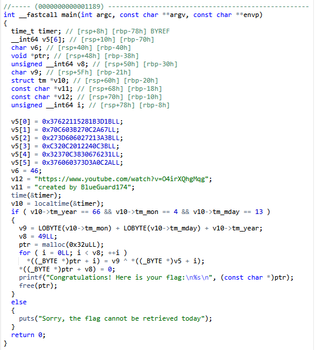

# The Blackest Friday the 13th

\
Реверсим бинарь\
\
Видим, что он проверяет, чтобы дата была 13 мая 1966 года\
Такую дату мы поставить не можем, потому что epoch (точка отсчета) у Unix подобных систем - 1 января 1970\
Придется реверсить флаг вручную\
Видим, что для получения флага каждый байт v5 XOR'ится с v9\
Напишем небольшой скриптик для получения флага
```python
v5 = [
    0x37622115281B3D1B,
    0x70C603B270C2A67,
    0x273D606027213A3B,
    0xC320C2012240C3B,
    0x32370C3830676231,
    0x376060373D3A0C2A
]
encoded_bytes = b''.join(x.to_bytes(8, 'little') for x in v5)
v9 = 66 + 4 + 13
flag = ''.join(chr(byte ^ v9) for byte in encoded_bytes[:49])

print("Flag:", flag)
```
